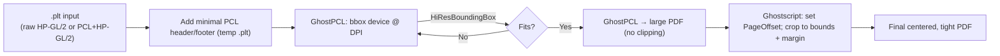

# PLT → PDF (crop & center)

Convert legacy HP-GL/2 plot files (`.plt`) into clean, centered, tightly cropped PDFs — works with files *with or without headers*.


* **Header-agnostic:** accepts raw HP-GL/2, mixed PCL/HP-GL/2, and old plotter dumps.
* **Auto-wraps** inputs with a minimal PCL header/footer so modern renderers don’t choke.
* **Two-pass pipeline** for accuracy: measure → recenter & crop.
* Handles oversize drawings by **auto-expanding** the working canvas until nothing clips.

<details>
<summary><strong>How it works (diagram)</strong></summary>



</details>


## Requirements

Make these executables available via flags, env vars, or `PATH`:

- **GhostPCL / PCL6** (`pcl6`, `gpcl6win64.exe`) — [Artifex GhostPDL releases](https://github.com/ArtifexSoftware/ghostpdl-downloads/releases)
- **Ghostscript** (`gs`, `gswin64c.exe`) — [Artifex GhostPDL releases](https://github.com/ArtifexSoftware/ghostpdl-downloads/releases)


**Lookup order**

1. CLI flags: `--gpcl`, `--gs`
2. Env vars: `GHOSTPCL`/`GPCL`, `GHOSTSCRIPT`/`GS`
3. System `PATH` (Windows *Program Files* auto-scan included)


## Quickstart

Convert a directory (recursively):

```bash
python conv.py "C:\path\to\plans" -r
```

Single file → PDF next to it:

```bash
python conv.py "C:\path\to\file.plt"
```


## CLI

```text
python conv.py INPUT [options]
```

| Option              | Description                                   | Default         |
| ------------------- | --------------------------------------------- | --------------- |
| `INPUT`             | `.plt` file or directory                      | —               |
| `-o, --output PATH` | Output PDF (file input) or folder (dir input) | alongside input |
| `-r, --recursive`   | Recurse into subfolders (dir input)           | off             |
| `--gpcl PATH`       | GhostPCL executable                           | auto-discover   |
| `--gs PATH`         | Ghostscript executable                        | auto-discover   |
| `--dpi N`           | Render resolution                             | `500`           |
| `--margin-pts PTS`  | Uniform PDF margin (pt)                       | `40.0`          |
| `--edge-eps PTS`    | Canvas growth tolerance (pt)                  | `1.0`           |

